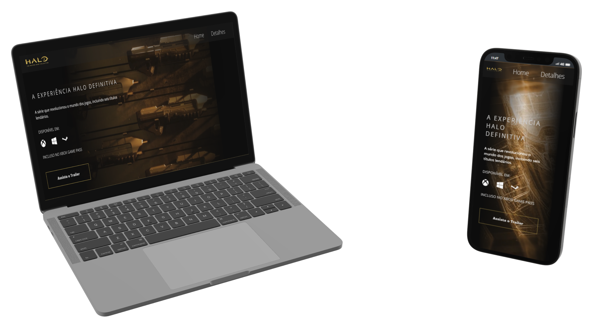
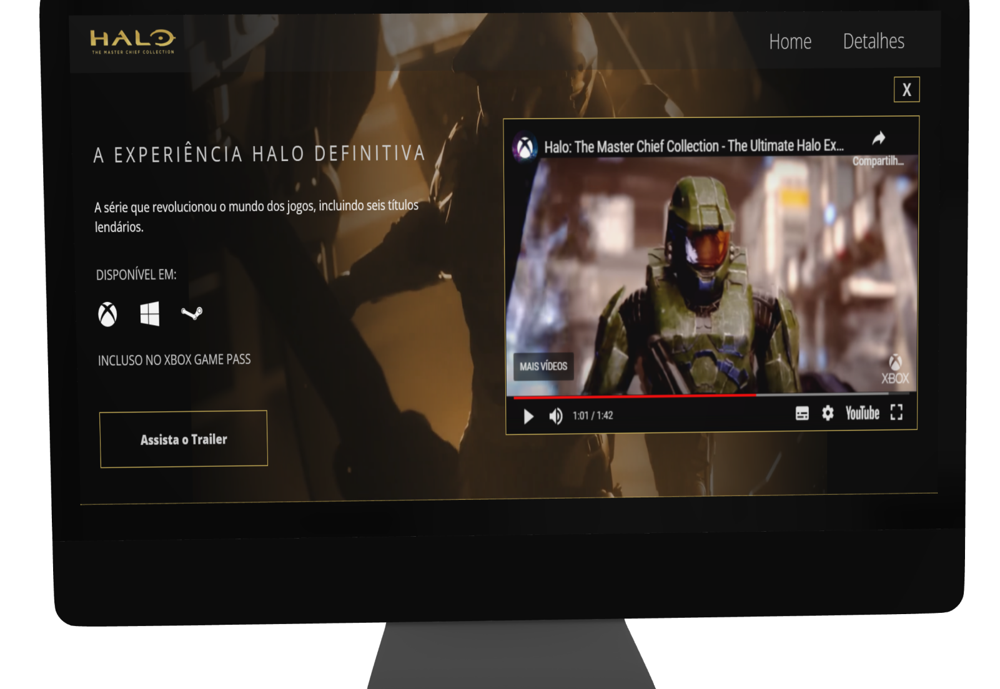
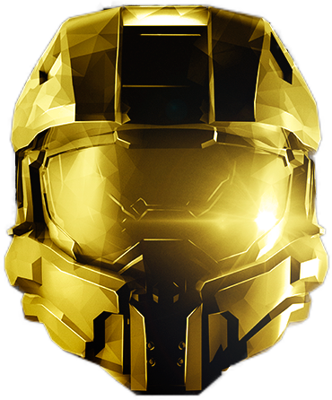

#  [Halo: Master Chief Collection](https://carloscunha611.github.io/halo-masterChiefCollection/)

    

> Site de promoção de um produto, neste caso o jogo eletrônico da produtora de jogos Xbox Studios.

## 💻 Funcionalidades e descrições

- Site otimizado para acesso em dispositivos móveis, tablets e desktops.
- Vídeo explicativo integrado ao site, permitindo aos usuários assistirem ao trailer ou gameplay do jogo sem sair da página.
- Design moderno e atraente, com destaque para imagens do jogo e elementos visuais relacionados à temática.

  

## ⚙ Tecnologias

- HTML5
- CSS3 / Scss
- JavaScript
- Git / GitHub

## 🔗 Portfólio e links

  
  

